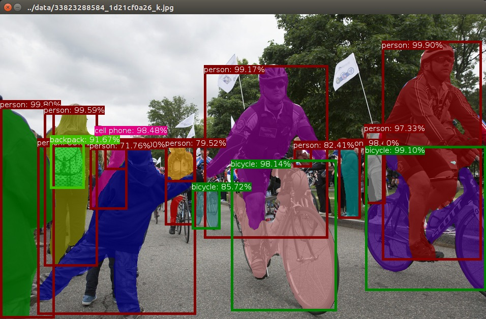

# call-python-from-cpp

Example Code of Calling Python from C++,
following the instruction
<a href="https://pybind11.readthedocs.io/en/stable/advanced/embedding.html"><i>Embedding the Interpreter</i></a>.

## Installation

```bash
# for example_001 - example_003
sudo python3 -m pip install numpy
sudo python3 -m pip install scipy

# for example_004
sudo python3 -m pip install opencv-python
sudo python3 -m pip install chainer
sudo python3 -m pip install chainercv
sudo python3 -m pip install imgviz
sudo python3 -m pip install pyglet
sudo python3 -m pip install cupy-cuda101     # CUDA10.1, cupy-cuda92 for 9.2
```

```bash
mkdir build
cd build

cmake ..
make
```


## Examples

### Hello World! ([src/example_001.cpp](src/example_001.cpp))

```bash
$ cd build
$ ./example_001
Hello, World!
```

### Import SciPy ([src/example_002.cpp](src/example_002.cpp))

```bash
$ cd build
$ ./example_002
sys version: 3.5.2 (default, Nov 12 2018, 13:43:14) 
[GCC 5.4.0 20160609]
scipy version: 1.3.0
```

### Communicate Numpy Array ([src/example_003.cpp](src/example_003.cpp))

```bash
$ cd build
$ ./example_003
shape: 768 1024 3
ndim: 3
==> Saved to: image.jpg
```

<br/>`image.jpg`

### Run Mask R-CNN ([src/example_004.cpp](src/example_004.cpp))

```bash
$ cd build
$ ./example_004
ndim: 3
shape: (600, 956, 3, )
```

<br/>`cv::imshow(...)`
